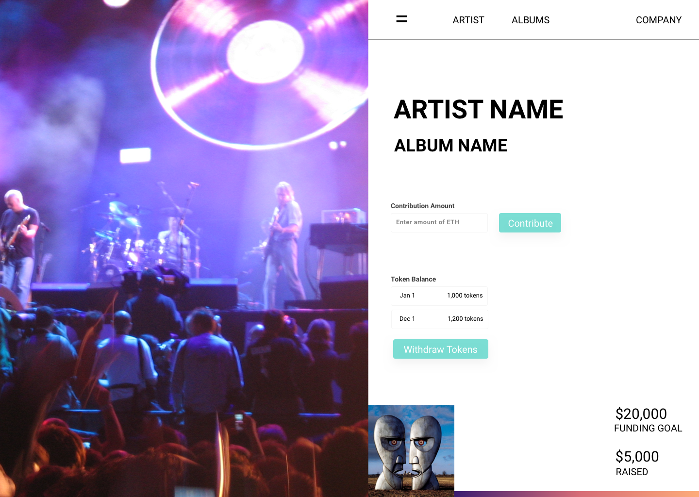

# UMG_Hackathon

### Directory Structure

#### AlbumERC20.sol
This contract creates an ERC20 per each Album being deployed under the Capitol Records Label, under the ERC20Detailed Standard.

#### AlbumNFT.sol
This contract creates a Non Fungible Token per each Album being deployed under the Capitol Records Label, with metadata including the album's details, creating a corresponding digital asset that can be traded and speculated on. This is based on the the ERC721 standard.

#### AlbumERC20Registry.sol && AlbumNFTRegistry.sol
Each of these registries handle deploying and accounting of new tokens minted under their respective standards

#### CapitolRecords.sol
This is the main contract for DAPP developers to use to deploy new tokens per album and handle distribution of funds, as well as providing a single point of accepting funds from end users.

### How to run the smart contracts locally
1. `git clone` this repo
2. `cd` into the repo
3. `nvm use stable && yarn install`
4. In a separate terminal, `ganache-cli -p 8545`
5. `truffle migrate --reset`

This should deploy the smart contracts onto the local blockchain through ganache-cli. You can now interact with the smart contract via either web3.js or from other smart contracts, or by using the `truffle console`.
